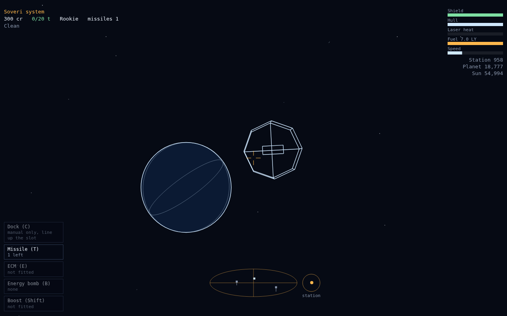
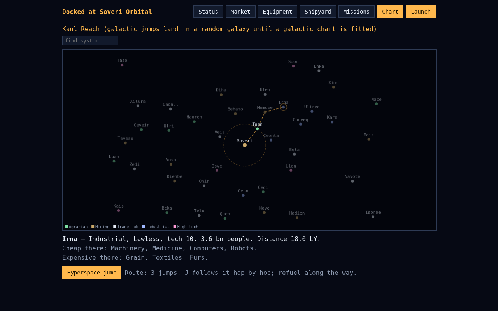
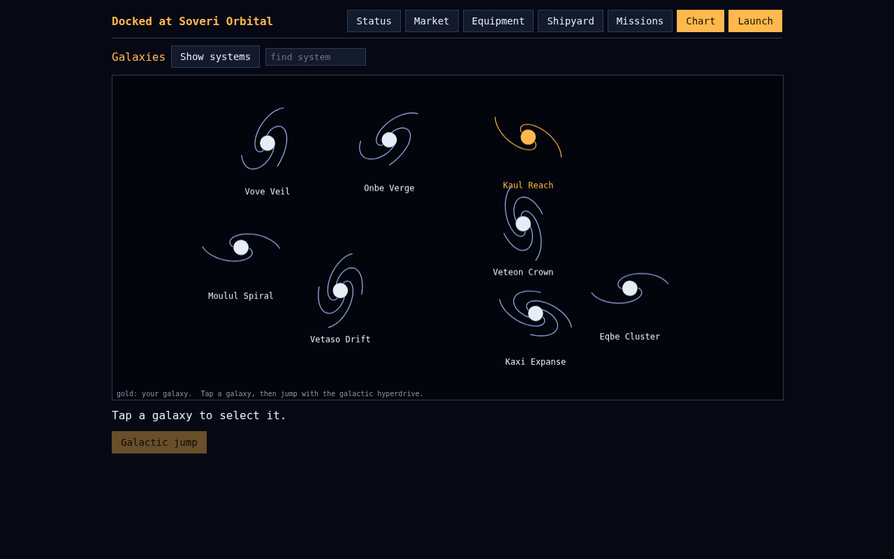
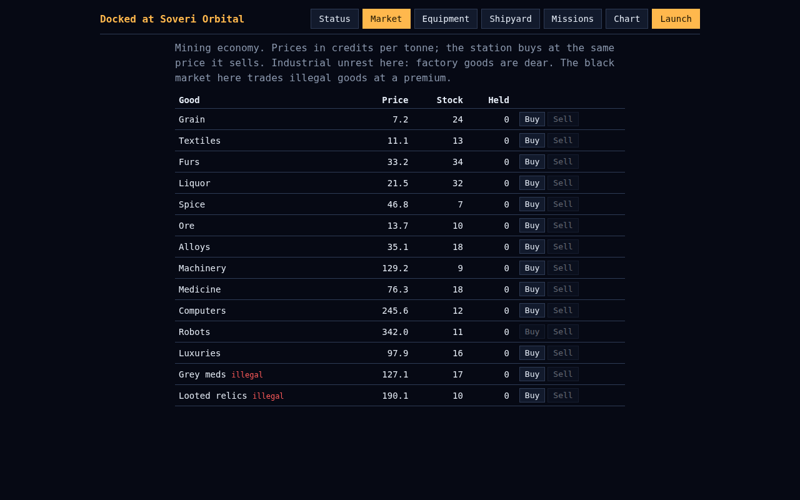
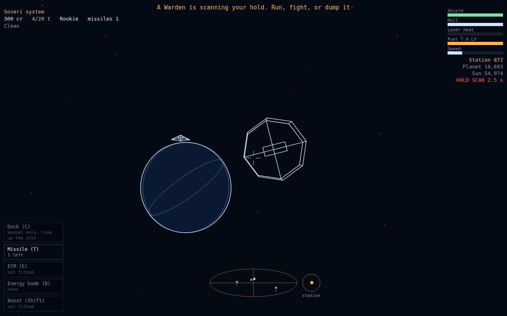
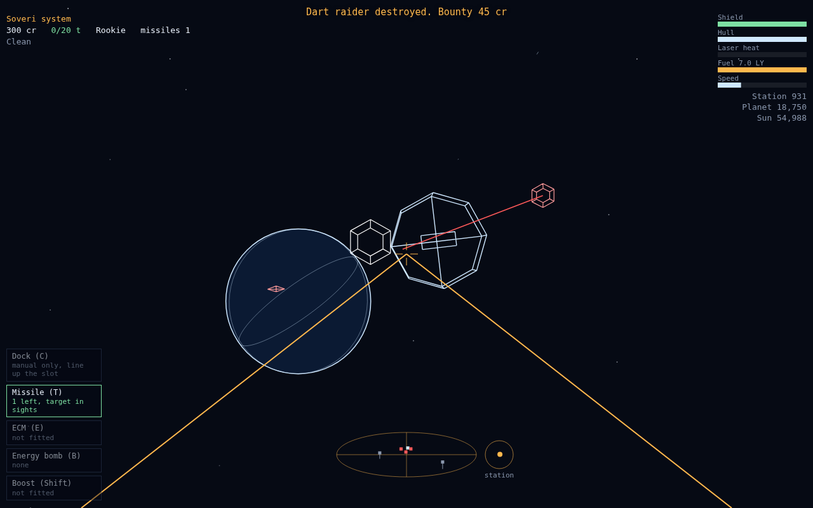
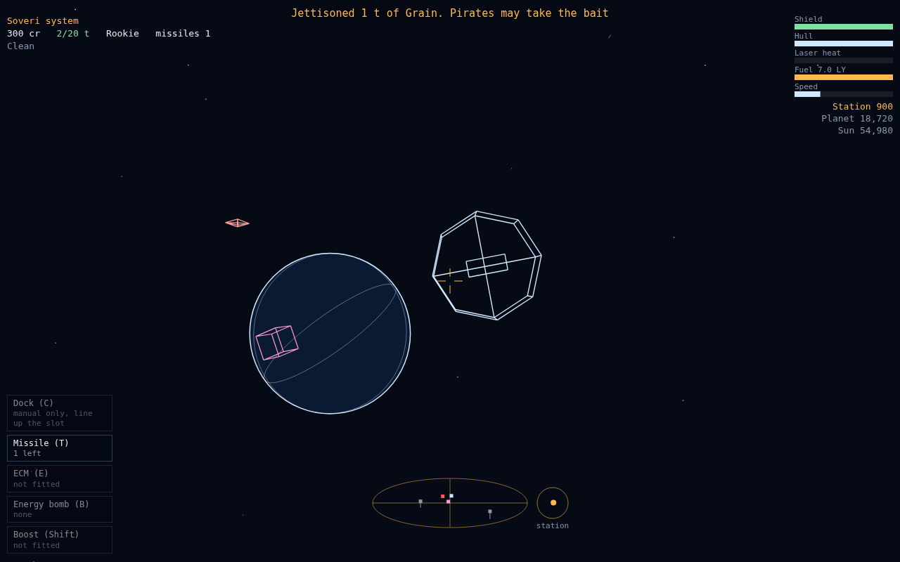
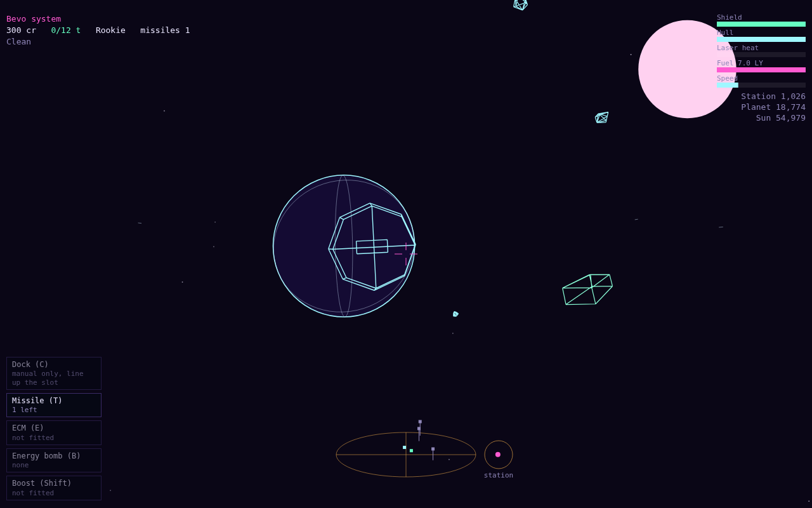

# The Vectorfall flight manual

*Issued to every newly licensed commander, together with one lightly used ship,
a tank of fuel, and the sincere hopes of the licensing office.*

Vectorfall is a wireframe space trading and combat game in the spirit of the
1984 classic. You start docked at a station with a small ship and a smaller
bank balance. Everything after that — the cargo runs, the fights you pick and
the ones that pick you, the slow climb from Rookie to Legend — is yours to
arrange. This manual tells you how the ship works, how the money works, and
how to stay on the right side of the Wardens. Or the wrong side, profitably.

---

## 1. Your first hour

Pick a difficulty on the title screen. Normal is the classic deal: 300 credits
and nobody owes you anything. Easy starts you richer among gentler pirates;
Hard does the opposite. Sandbox hands you 100,000 credits and opens every
shipyard and equipment list from the start — good for seeing what's out there,
less good for feeling like you earned it.

Then do the oldest trade route in the book:

1. Dock tab **Market**: buy grain or whatever is cheap where farmers live.
2. Open the **Chart**, tap a nearby industrial system inside the dashed ring —
   the ring is how far your fuel reaches.
3. **Launch**, press **J**, and watch the stars stretch.
4. Fly toward the station (the compass by the scanner points at it), line up
   the rotating docking slot, slow down, press **C**.
5. Sell high. Repeat until the shipyard stops laughing at you.

A few trips of that pays for a cargo bay extension, then a better laser, and
then you have choices. Vectorfall is a game about choices arriving faster
than the money to pay for them.

## 2. Flying the ship

Arrows pitch and roll (**A**/**D** also roll), **W**/**S** work the throttle,
**Space** fires. The ship keeps its speed; space is kind that way. **Shift**
holds the fuel injectors open for 2.5 times your top speed — it burns
hyperspace fuel, so a long chase can quietly spend your ride home.

On a phone, drag on the left of the screen to steer; the buttons on the right
cover fire, throttle and the chart, and the panel on the left handles docking,
missiles, ECM, the bomb and boost.

**Docking by hand.** The station turns. The slot turns with it. Put the slot
in the middle of your screen, get your speed down, and let the station grow
until the slot takes you. Rushing it costs hull; the station always wins the
argument. A docking computer (press **C** from anywhere nearby) removes the
skill and the fear, in exchange for 800 credits — steering cancels it if you
change your mind.

*Fig. 1 — Final approach. Slot in the middle, speed low, nerves optional.*

**The sun.** You can skim it for free fuel if you carry a scoop, and the trick
is exactly as safe as it sounds. Watch the cabin temperature bar. Pilots who
watch only the fuel gauge are remembered fondly.

**Shields and hull.** Shields come back on their own; hull does not. Patch it
at any station before someone tests it for you.

## 3. The chart

Tap a system to read its economy, government, tech level and distance; dock
somewhere and the market note tells you what the local news is doing to
prices. A famine pays triple for staples. A festival makes everything
pleasantly cheap. News moves on, so a good route today is a mediocre one next
week — check the chart info line before committing the hold.

Type into the **find system** box to jump the selection by name. Pick a
system beyond your fuel and the chart plots a dashed route through systems
you can actually reach, fewest jumps first; **J** then follows it hop by hop,
refuelling stop by stop. Some systems sit beyond any tank's reach of anywhere
— the chart will tell you, and no, there's nothing there. Probably.

*Fig. 2 — A plotted route. Each dash of the line is somebody's refuelling bill.*

Fit a **galactic chart** and the "Show galaxies" button reveals the other
galaxies as spirals; a **galactic hyperdrive** is a one-shot ticket to one of
them. Without the chart fitted, the drive still works — it just doesn't ask
where you'd like to go.

*Fig. 3 — The galaxies. Gold is where you are; the rest is where your creditors aren't.*

## 4. Honest trading

Every good has a nature. Farm goods are cheap where farmers live and dear
where machines do the living; industrial goods run the other way. Buy against
the slope, sell with it. The **market scanner** adds a column comparing the
local market with whatever system you've selected on the chart, and the
**trade computer** turns that into expected prices, which is as close to
insider trading as the law allows.

Cargo scooped from space — canisters, ore off a cracked asteroid — cost you
nothing but the risk of collecting them. A mining laser turns asteroids into
ore; a scoop turns near-misses into income.

## 5. The wrong side of the law

Some goods are marked **illegal** in the market. Proper governments won't
touch them; lawless systems run a black market that pays a handsome premium
and asks no questions. The spread between those two facts is a living, and
the Wardens know it as well as you do.

*Fig. 4 — A black market doing business. Note which column nobody questions.*

Carry contraband near a Warden patrol and you'll see **HOLD SCAN** counting
down on your readout. You have about four seconds and exactly four options:
run out of range, kill the scanner, press **X** until the evidence is
somebody else's salvage, or trust your jammer. Caught means the cargo seized,
a fine half again its value, and your name on a list.

*Fig. 5 — HOLD SCAN, 2.6 seconds. Four options, and one of them is the X key.*

The **scan jammer** comes in three marks. Each one shortens the reach a
Warden can scan from and worsens their odds of finding anything. Mk III
mostly turns scans into an amusing light show, for a price that says so.

Your legal status runs Clean, Offender, Fugitive. Offenders get fined and
forgiven at any respectable dock. Fugitives get bounty hunters — named ships
with good hulls and bad intentions that keep arriving until you stop being
interesting. Killing Wardens, for the record, is how people become Fugitives.

## 6. Fighting

The crosshair is the whole interface: put a ship in it and hold **Space**.
The laser heats with every shot and shuts down at the red line, so fire in
bursts and let it breathe. When something explodes, there's often a canister
in the wreckage worth scooping. Your victim's friends know that too.

*Fig. 6 — Three raiders, one crosshair. The bounty line at the top is the part worth reading.*

**Weapons** — your ship has one forward weapon; the shipyard takes the old
one in trade when you change your mind:

| Weapon | Character |
| --- | --- |
| Pulse laser | The standard fit. Light, cool-running, apologetic |
| Mining laser | Hits harder, and cracks asteroids into ore |
| Beam laser | More than double the pulse damage per shot |
| Scatter laser | Splits across up to three ships near the crosshair; made for pirate packs |
| Rail lance | One shot, one very bad day for somebody. Slow, scalding hot, needs a heavy mount |

Ships have one, two or three **weapon mounts**. Light couriers take light
guns; a heavy hull with three mounts can also carry an **aft turret** that
shoots at whatever is behind you without being asked, and anything with two
mounts can fit **point defence**, which swats incoming missiles on its own.

**Missiles** (**T**) chase the ship in your sights until something gives.
**ECM** (**E**) burns every missile nearby, including yours. The **energy
bomb** (**B**) removes every ship in range from the conversation once — the
Wardens count it rather carefully.

**The oldest trick.** With pirates on your tail and a hold full of goods,
press **X**: a canister tumbles out behind you, and pirates break off and
chase the canister instead of you. One tonne is a cheap price for a hull.
It works on the greedy, which is most of them.

*Fig. 7 — One tonne of grain, buying a whole ship. The raider has already changed its mind about you.*

**The last trick.** An escape pod means your death is a financial event
rather than a biographical one: cargo and ship are gone, credits and
equipment survive, and the station issues you the cheapest thing with wings.

## 7. Contracts

Stations post up to three contracts at a time on the Missions tab:

- **Couriers** carry a sealed pouch to a named system. The urgent kind pays
  much better and fails if you take more jumps than the clock allows — count
  the route before you sign.
- **Bounty work** pays per pirate, anywhere, collected at your next dock.
- **The hunt** names a renegade gunship — the Black Hex — and a system it
  haunts. It carries missiles and does not want to be found. The reward
  reflects both facts.

## 8. The travel autopilot

Needs a docking computer fitted, and comes in three marks that sell you
increasingly honest amounts of your own time back:

- **Mk I** flies the plotted route the way you would: launch, jump, crawl to
  the station, dock, pay for fuel, relaunch. It disengages the moment
  hostiles show up — the fighting stays yours.
- **Mk II** stops for nothing. It tanks up in flight, takes whatever
  punishment the route serves, and aborts only if the hull drops below a
  quarter. You pay in fuel money and repair bills.
- **Mk III** doesn't fly at all. The journey plays out on the chart, a short
  paid refuel stop at each system, the route line shrinking hop by hop until
  you're docked at the far end. Each stop counts as a docking — which means
  respectable ports will deduct your outstanding fines along the way.
  Convenient, mostly for them.

Touch the controls and any mark hands the ship straight back.

## 9. Universes

Everything in Vectorfall — the goods, the ships, the laws, the colours, the
worlds themselves — comes from a universe file, and the title screen has a
dropdown full of them. Rust belt runs on scrap and rations. Umbral drift is
smuggler country where half the economy is illegal by design. Phosphor wastes
is what's left when the machines stop being told what to do. Switching
universes re-themes the whole game on the spot, and the Data panel in dock
offers the same list with a line about each.

*Fig. 8 — Neon reach. Same controls, same physics, entirely different arm of space.*

**Today's universe** on the title screen deals the same unknown worlds to
everyone who presses it that day. Same seed, same galaxies, no second
chances until tomorrow.

Three **commander slots** on the title screen keep separate careers — one
honest hauler, one Fugitive, one for the daily, say. Everything exports to
files too: commanders (which carry their universe with them) and universes
both, from the Data panel. The universe editor, where new worlds get made,
is a separate tool; its files load here.

## 10. The small print

- Sound is synthesized on the spot — no files, just physics complaints. The
  "Sound" button on the title screen or status tab turns it off and remembers.
- Progress saves on every docking. Death deletes the save; that's the game.
  The escape pod exists for people who disagree.
- Your rating climbs with kills, from Rookie to Legend, and appears on your
  status page where other people can't see it. You'll know.

## Appendix: keys

| Key | Action |
| --- | --- |
| Arrows | Pitch and roll |
| A / D | Roll |
| W / S | Throttle |
| Space | Fire |
| T | Missile at the ship in your sights |
| E | ECM burst |
| B | Energy bomb |
| X | Jettison one tonne of cargo |
| Shift (hold) | Fuel injectors |
| C | Dock when lined up, or docking computer |
| M | Galactic chart |
| J | Hyperspace to the selected system (follows a plotted route) |
| G | Galactic hyperdrive |

Fly safe. Failing that, fly paid.
